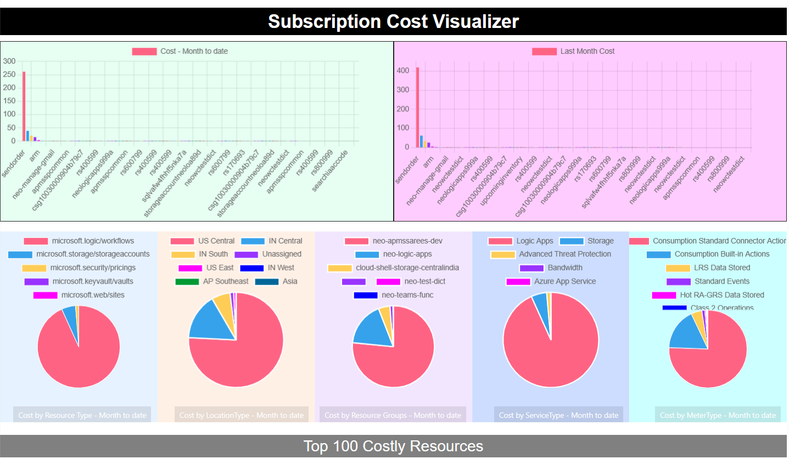

# Azure Subscription Cost Visualizer

This is a code repository for simple visualization of Azure Subscription Cost. Code can be cloned locally and with some tweaking, it can be run on local system.

This provides cost details as per below:

- Cost details of resources for MonthToDate.
- Cost details of resources for last billing month
- Cost by Resource Types.
- Cost by Locations.
- Cost by Resource Groups.
- Cost by Service
- Cost by Meter

## Prerequisites

In order to successfully run this solution , below prerequisites need to be available:

- An Azure subscription
- An application registered in Azure active directory (we would need client ID and client secret while running)
- Python and flask installed in local system or environment where solution is running
- Make sure application has at least 'Reader' permissions on subscription to read the cost data

## Getting Started - Running the application locally

Follow the step below to setup and run the solution.

1. **Install python and flask to local system:**
   - Download and install python from official [site](https://www.python.org/downloads/).
   - Install flask by running:
     - `pip install Flask`

2. **Collect following details as they will be required to run the code** 
   - Azure subscription ID of which cost need to be visualized
   - Application ID 
   - Application secret
   - Tenant ID

3. **Clone the repo locally. In main.py, replace the values collected in above step for following variables:**
   - client_id: Replace with your application ID
   - client_secret: Replace with your application secret
   - tenant_id: Replace with your tenant ID
   - subscription_id: Replace with your subscription ID

4. **Running application locally:**

   - Navigate to the cloned folder where 'main.py' is present
   - Run following command to execute flask application (make sure you have replaced the above values):
     - `python3 main.py`

## Getting Started - Running the application in docker container

Follow the below steps to run the application in docker container.

1. ***Make sure you have docker installed in system***.
2. Navigate to cloned folder where 'Dockerfile' exists and build image as per below command:
   `docker build -t [IMAGE_NAME] .`

   - replace [IMAGE_NAME] with your own name.
3. Run the container using below command:
   
   `docker run -p 5000:5000 [IMAGE_NAME]`
4. Open below url in browser to see the output:
   
   http://localhost:5000